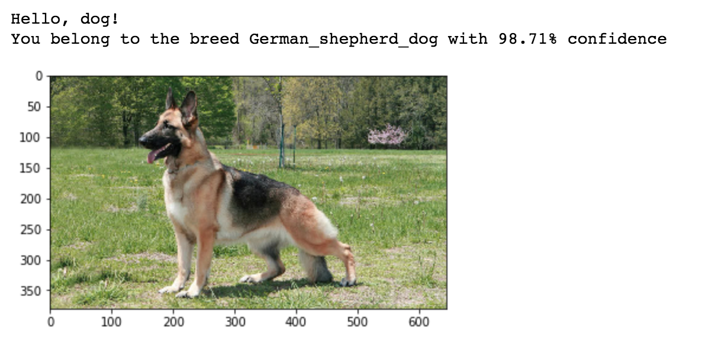
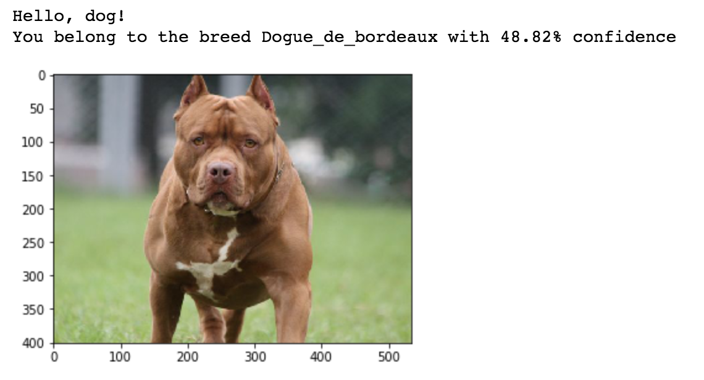
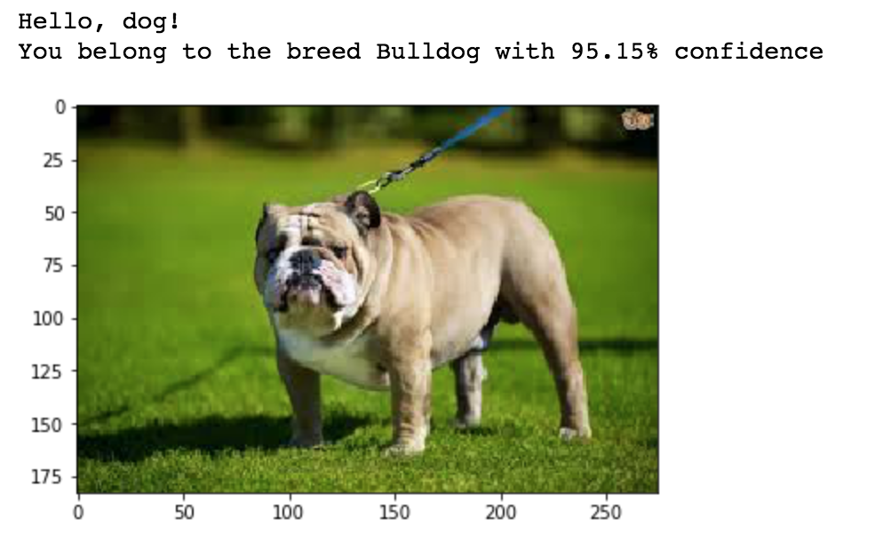
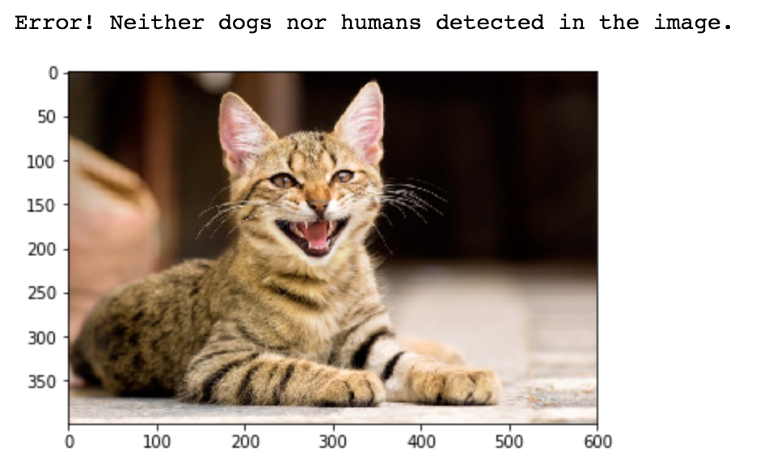
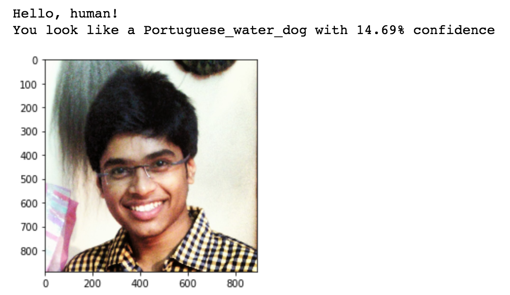
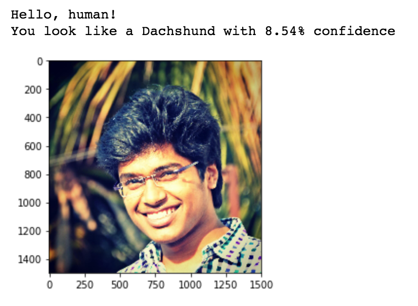

# Dog Breed Classifier 

## Blog Post Link: https://medium.com/@chalam.pusuluri/whats-the-breed-of-your-dog-d35f867e514b?source=friends_link&sk=5356056a3c2b4d88ad5dacee9324a990

## Motivation

The project is aimed at developing an algorithm to identify the breed of a dog. Moreover, if the input image is a human one, the algorithm should rightly identify it so, and also spit out the closest resembling dog breed. Towards this end, various deep learning architectures along with other models are explored and fine-tuned. 

The origin of the image classification problem using Deep Learning, in general, links back to the [ImageNet Large Scale Visual Recognition Challenge](http://image-net.org/challenges/LSVRC/). Hence, the ImageNet challenge serves as the main inspiration for the project. Also, this project was originally developed by Udacity as one of its various options for a Data Scientist Capstone Project. The goal of this exercise is to solve the problem by building a dog breed classification model.

The data sets used in the project are:
- Images of different breeds of dogs (133 of them).
- Image of human faces.

The instructions to download the images are provided below.

## Requirements

- Python 3.5 or higher
- OpenCV
- Matplotlib
- Numpy
- Scipy
- Tqdm
- Keras
- Scikit-learn
- Pillow
- Tensorflow
- IPython Kernel

Note: Most of the requirements can be downloaded from [Anaconda](https://www.anaconda.com/download/#macos)

## Repository Break-down

 - images: a folder which contains the various images used in the ipython notebook
 - dog_breed_classifier.ipynb: the jupyter notebook where the model is built
 - dog_breed_classifier.html: the html version of the jupyter notebook
 - extract_bottleneck_features.py: a python helper function to extract bottleneck features

Note: OpenCV's pre-trained models for face detectors, images of dogs and humans, and deep learning architectures along with their bottleneck features are deliberately not included in the repository due to size constraints. For the same reason, trained model weights are also avoided in the repository. You can download the same from the below given links:

- [OpenCV haarcascade](https://github.com/opencv/opencv/tree/master/data/haarcascades). Download the relevant models and place it in the repo, at the location `path/to/repo/haarcascades/haarcascade_frontalface_alt.xml`

- [Dog dataset](https://s3-us-west-1.amazonaws.com/udacity-aind/dog-project/dogImages.zip).  Unzip the folder and place it in the repo, at location `path/to/dog-project/dogImages`. 

- [Human dataset](https://s3-us-west-1.amazonaws.com/udacity-aind/dog-project/lfw.zip).  Unzip the folder and place it in the repo, at location `path/to/dog-project/lfw`.  If you are using a Windows machine, you are encouraged to use [7zip](http://www.7-zip.org/) to extract the folder. 

- [VGG-16 bottleneck features](https://s3-us-west-1.amazonaws.com/udacity-aind/dog-project/DogVGG16Data.npz) for the dog dataset.  Place it in the repo, at location `path/to/dog-project/bottleneck_features`.

- [VGG-19 bottleneck features(https://s3-us-west-1.amazonaws.com/udacity-aind/dog-project/DogVGG19Data.npz) for the dog dataset.  Place it in the repo, at location `path/to/dog-project/bottleneck_features`.

- [ResNet-50 bottleneck features](https://s3-us-west-1.amazonaws.com/udacity-aind/dog-project/DogResnet50Data.npz) for the dog dataset.  Place it in the repo, at location `path/to/dog-project/bottleneck_features`.

- [Inception bottleneck features](https://s3-us-west-1.amazonaws.com/udacity-aind/dog-project/DogInceptionV3Data.npz) for the dog dataset.  Place it in the repo, at location `path/to/dog-project/bottleneck_features`.

- [Xception bottleneck features](https://s3-us-west-1.amazonaws.com/udacity-aind/dog-project/DogXceptionData.npz) for the dog dataset.  Place it in the repo, at location `path/to/dog-project/bottleneck_features`.

## Results Summary

The summary of the accuracy value used as an evaluation metric for the project for various architectures is given below:

|Architecture|Trainable Parameters|Train Accuracy|Valid Accuracy|Test Accuracy|
|--|--|--|--|
|Custom| 24,831,909 |97.6%| 5.03% | 4.19%|
|VGG16| 68,229 |63.58%| 49.7% | 49.76%|
|VGG19| 68,229|61.74% | 48.14%|50.0%
|ResNet-50| 272,517|99.82%| 82.75%| 79.9%|
|Inception| 272,517|98.88%|86.23%|77.75%|
|**Xception**| 272,517|97.98%|84.91%|**83.25%**|

Some visual results:

## Future Work for Improvement

The three potential points of improvement in the algorithm are:

- The algorithm can be improved to be able to differentiate between fully grown dogs and puppies. This would be an additional imporovement to our present model wherein we not only classify the dog breeds, but also whether the dog is a fully grown one or a puppy. 

- It can also be fine-tuned to correctly identify different breeds of dogs/cats in the same image. Incorporating the will allow the model to identify multiple dogs and their respective breeds in the input image and not just a single one.

- Also, for human input images, the model can be further improved to bring the confidence down to 0%. Although the present model rightly classifies human images with ~10-15% confidence, striving to bring this further down will help improve the model performance.

## Acknowledgments and References

- [ResNet Paper](https://arxiv.org/abs/1512.03385) Xiangyu, ZhangJian Sun
- [Inception Paper](https://arxiv.org/abs/1512.00567) Christian Szegedy, Vincent Vanhoucke, Sergey Ioffe, Jonathon Shlens, Zbigniew Wojna
- [VGG Paper](https://arxiv.org/abs/1409.1556) Karen Simonyan, Andrew Zisserman
- [Xception Paper](https://arxiv.org/abs/1610.02357) François Chollet
- [Udacity Github Dog Project](https://github.com/udacity/dog-project)
- [OpenCV Github Models](https://github.com/opencv/opencv/tree/master/data/haarcascades)

Heartfelt gratitude to Udacity for putting forth together excellent resources that are critical for the project. 

## License

MIT License

Copyright (c) 2018 Uirá Caiado

Permission is hereby granted, free of charge, to any person obtaining a copy
of this software and associated documentation files (the "Software"), to deal
in the Software without restriction, including without limitation the rights
to use, copy, modify, merge, publish, distribute, sublicense, and/or sell
copies of the Software, and to permit persons to whom the Software is
furnished to do so, subject to the following conditions:

The above copyright notice and this permission notice shall be included in all
copies or substantial portions of the Software.

THE SOFTWARE IS PROVIDED "AS IS", WITHOUT WARRANTY OF ANY KIND, EXPRESS OR
IMPLIED, INCLUDING BUT NOT LIMITED TO THE WARRANTIES OF MERCHANTABILITY,
FITNESS FOR A PARTICULAR PURPOSE AND NONINFRINGEMENT. IN NO EVENT SHALL THE
AUTHORS OR COPYRIGHT HOLDERS BE LIABLE FOR ANY CLAIM, DAMAGES OR OTHER
LIABILITY, WHETHER IN AN ACTION OF CONTRACT, TORT OR OTHERWISE, ARISING FROM,
OUT OF OR IN CONNECTION WITH THE SOFTWARE OR THE USE OR OTHER DEALINGS IN THE
SOFTWARE.